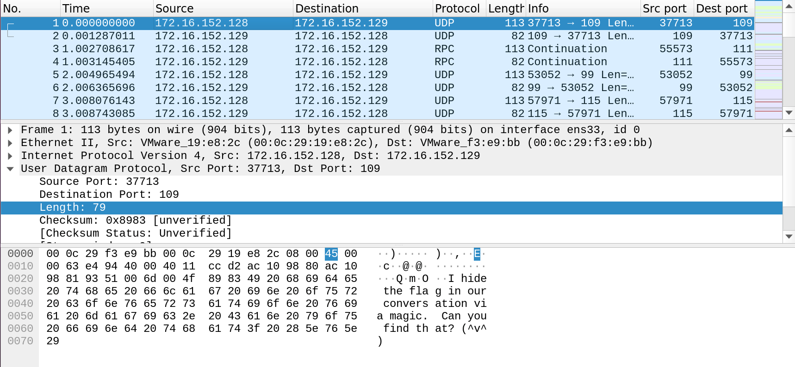
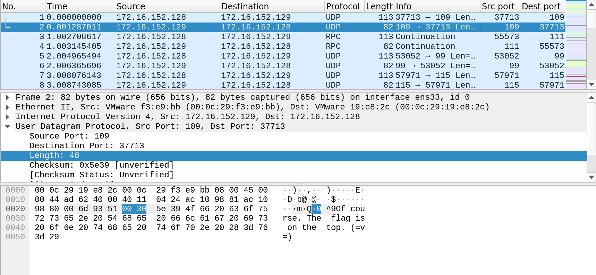
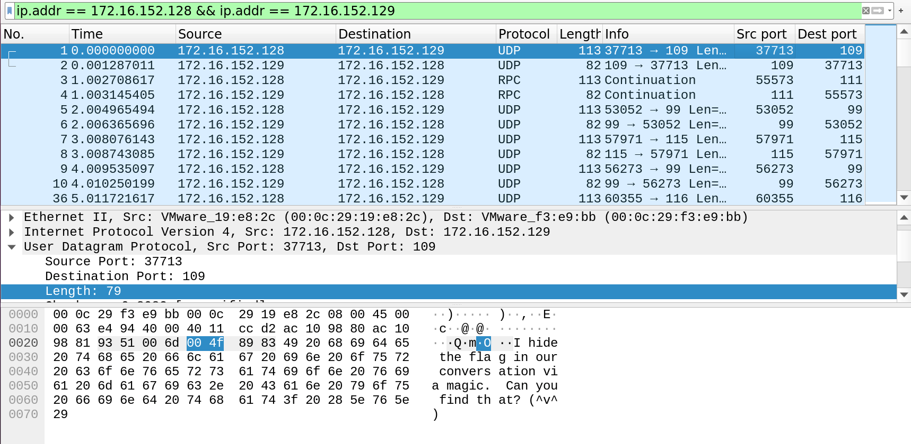
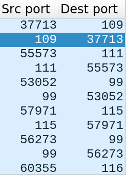
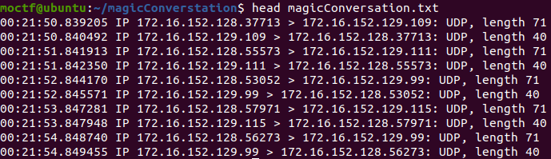
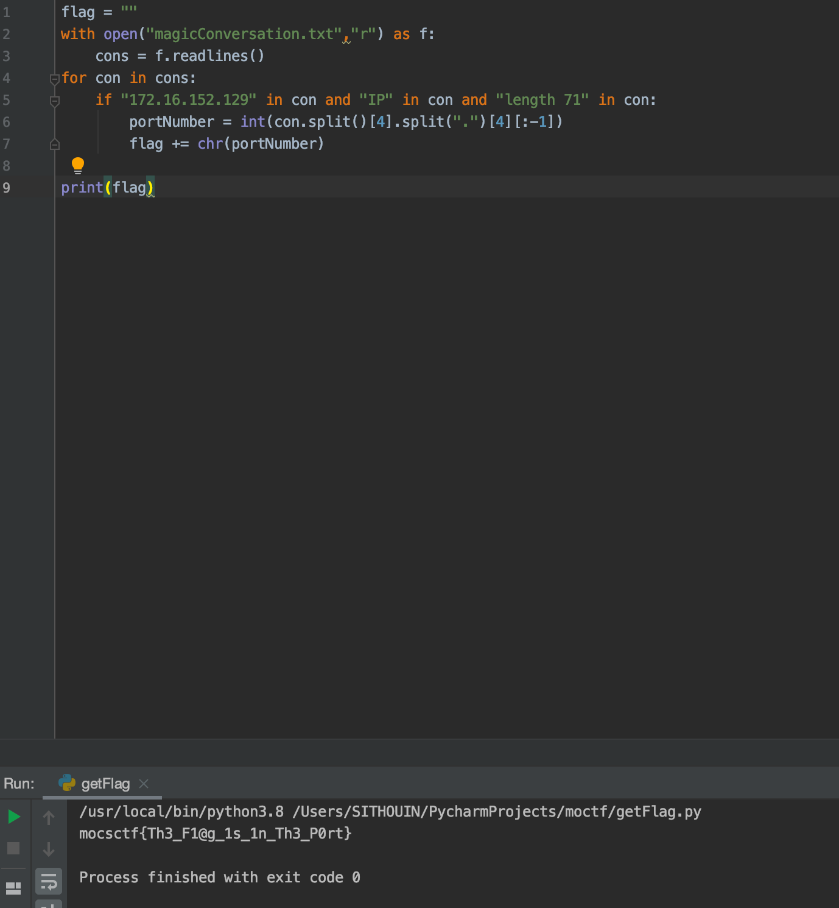

Magic Conversation  
Author: Harry Potter  
Category: Misc – Forensics  

Harry is a magician. He was talking to Hermione and used magic to make the conversation disappear. During the call, Voldemort used Hallows to interfere with their conversation. Can you strip out interference in the call and capture their conversation?  

MD5: c703a06ba99ecd074899579cb64ae9d5  [magicConversation.pcap](./magicConversation.pcap)  

Write-up:  
1.	Open the pcap file  
  
  
 
2.	We found this is the conversation between Harry and Hermione. It means these two IPs are related to the flag. Use the filter in Wireshark to check the detail  
  
3.	According to the reply, the flag is hidden on the top (which means OSI model Layer 4). We can see Harry used some weird ports on the conversation. Maybe the flag is hidden on the port numbers.  
  
4.	Use tcpdump to dump the information.  
  
  
 
5.	Get the flag via pythonma  
  
Flag: mocsctf{Th3_F1@g_1s_1n_Th3_P0rt}
