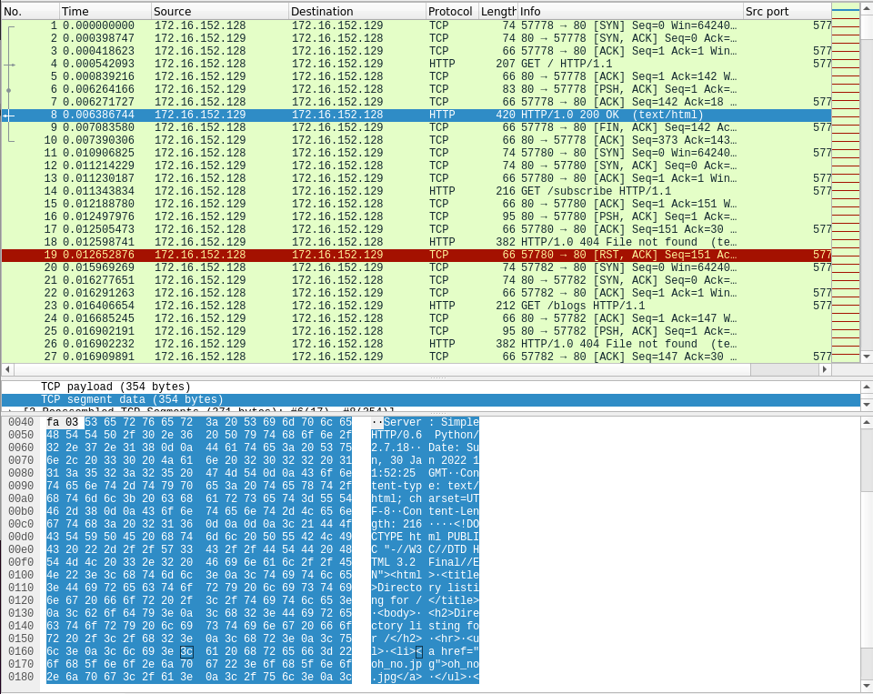
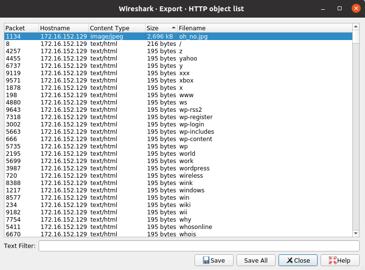
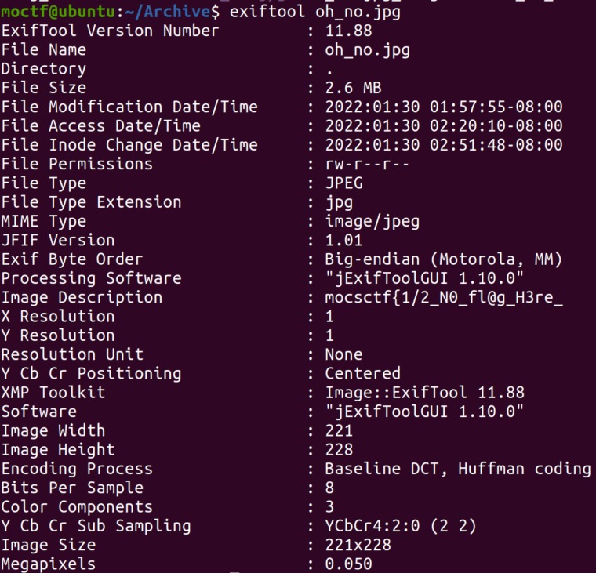
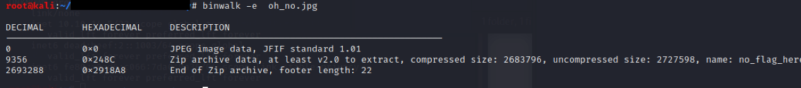
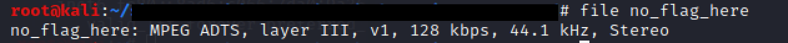
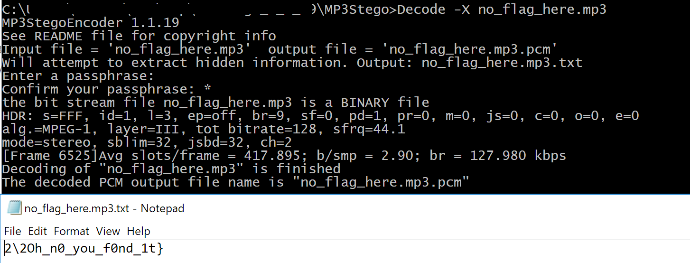

Oh No  
Author: Cinderella  
Category: Forensics  

Oh no @@ ~ Where is the flag?  

MD5: b3b1e9814f3688a1838e3bb468a03156  [OhNO.pcap](./OhNO.pcap)  

Write-up:  
1.	Open pcap file, will found the website exists an image. The image name is oh_no.jpg  
  
2.	Extract the image  
  
3.	Use exiftool to get the metadata of image. Found 1/2 flag   
  
4.	Binwalk the image, found file no_flag_here, use file command to see the filetype. Determine that is an MP3 file.  
  
  
 
5.	Use MP3stego to find the 2/2 flag (no passphrase for the MP3stego decode)   
  
Flag: mocsctf{1/2_N0_fl@g_H3re_2\2Oh_n0_you_f0nd_1t}

