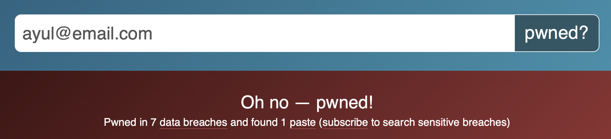

# Writeup
## haveibeenpwned

Decription:
The most notable password list, RockYou, is from a breach that occurred in 2009. One email account was pwned and was leaked on pastebin. 
The flag format likes MOCSCTF{email}

1. From google search, we found a list of MySpace User Account exposed. 

https://techcrunch.com/2009/12/14/rockyou-hack-security-myspace-facebook-passwords/

2. Check the list of account on haveibeenpwned.com.

https://haveibeenpwned.com

3. The search result of ayul@email.com.
```
Oh no — pwned!
Pwned in 7 data breaches and found 1 paste (subscribe to search sensitive breaches)
```



## flag
MOCSCTF{ayul@email.com}