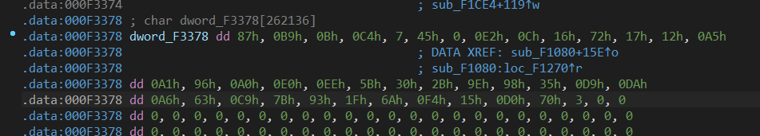

# babyxor

ida打开找到主函数，程序显示读取输入的字符串并且用全局变量dword_4C3370保存字符串长度，下面的do...while里有判断v10和byte_4B3370相不相等，其中x10可以看出是给了个定值。上面的sub_471080把字符串输入输入了进去


对byte_4B3370按x寻找引用，选择w的语句，此语句对byte_4B3370写入了值，可以猜测是将输入进行加密后再做比较


发现做了个异或运算，而dword_473378发现是程序生成的定值，双击查看内存数值


将变量转为dword array，可以获得更轻松的获得异或密匙，复制出来进行解密



```python
enc = [
  0xDA,0xCC,0xF,0x24,0x3B,0xD2,0xA,0x83,0xED,0xF0,0x5E,0xB6,0xE9,0x6A,0x85,0xEB,0xAE,0x82,0x84,0x48,0x38,0xB9,0x77,0x6F,0xCD,0xB1,0x6,0x83,0xD1,0x9B,0xD4,0x2C,0x6C,0xEC,0x12,0x3B,0x17,0x9C,0x7,0x6C,0x00
]

cipher = [
  0x97,0x83,0x4c,0x77,0x78,0x86,0x4c,0xf8,0xba,0xc3,0x6f,0xd5,
  0xd9,0x7,0xe0,0xb4,0xef,0xec,0xc0,0x17,0x4f,0xdc,0x1b,0xc,
  0xa2,0xdc,0x63,0xa2,0xf0,0xba,0x8b,0x7e,0x9,0xb3,0x23,0x48,
  0x48,0xd9,0x7d,0x11,0x2d,0xb8,0xdc,0x49,0x8b,0xd,0x7b,0xb8,
  0x1e,0x59,0x66,0xd2,0x80,0xb5,0x68,0x87,0xca,0xfe,0xf5,0xaf,
  0x61,0xe7,0xb,0xa4,0x7b,0x16,0xb8,0x8f,0x9b,0x7a,0x2e,0x39,
  0xd8,0x6c,0xbb,0xa0,0x7e,0xe6,0xc9
]

for i in range(len(enc)):
    print(chr(enc[i]^cipher[i]),end="")
```

得到flag MOCSCTF{W31c0me_AnD_welcome!!!_Re_1s_Ez}