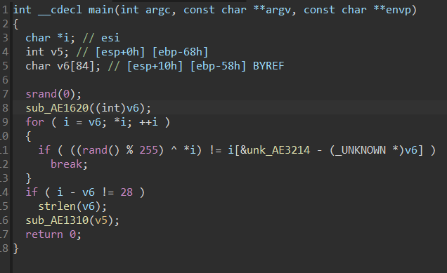
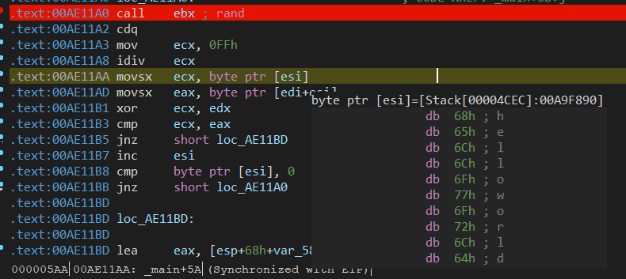
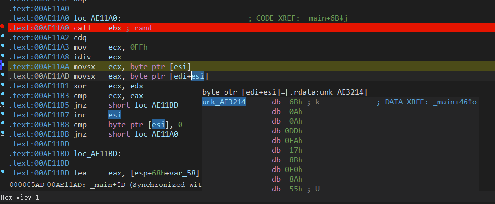

# easypy

用exeinfope可以看出程序是Pyinstaller打包的，用pyinstxtractor.py提取easypy.pyc，再用decompyle3反编译得到python脚本

```pyhon
import os, sys
path = sys._MEIPASS + '/' if hasattr(sys, 'frozen') else os.getcwd() + '/resources/'
icon = path + 'icon.png'
os.system(icon)
```

可见py脚本运行了资源中的icon.png文件，ida打开icon.png查看主程序得到以下结果



由动调很容易可以看出sub_AE1620为输入字符串，sub_AE1310是输出字符串，很明显可以发现ida f5结果有丢失且很难理解，动调加密流程地址AE11A0到AE11BB，能很清楚看出是利用rand赋值给了edx然后再和输入字符ecx进行异或。



最后再比较eax和加密后的ecx是否一致，所以提取出密文[edi+esi]，和每次异或的edx值即可



```python
enc = [
  0x6B, 0x0A, 0x0A, 0xDD, 0xFA, 0x17, 0x8B, 0xE0, 0x8A, 0x55, 
  0xC2, 0x7A, 0x4A, 0x74, 0xD6, 0x5E, 0x67, 0x4B, 0x93, 0xFE, 
  0x2D, 0x7F, 0x84, 0xF8, 0x3E, 0x75, 0x18, 0xB5
]

cipher = [
  0x26, 0x45, 0x49, 0x8E, 0XB9, 0x43, 0xCD, 0x9B, 0xFA, 0x0C,
  0xF3, 0x32, 0x7A, 0x1A, 0x89, 0x6F, 0x14, 0x14, 0xC0, 0x91,
  0x42, 0x10, 0xEB, 0x97, 0x61, 0x30, 0x42, 0xC8
]

for i in range(len(enc)):
    print(chr(enc[i]^cipher[i]),end="")
```

MOCSCTF{pY1H0n_1s_Sooooo_EZ}