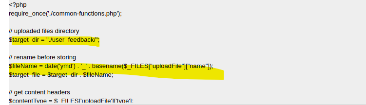

# Writeup  

Challenge title: Very Security Shop  

Category: WEB  

Skill: Client side restriction bypass, XXE, upload bypass, command injection  

Challenge description:  

Hello All! I just make my commercial website Very Security Shop! Please feel free to visit my site and we have BIG promotion now!  

Very Security Shop – Write Up  
WEB  

1.	Access the web site and browser around. You can find the contact form page which is more suspicious than other positions.  
  

2.	Let’s try from simple trick… try to upload a php script (maybe with shell inside):  
  
You will see “Only images are allowed”. If we drill a bit detail for the web page using Burp Suite, we can see that only a few extension.   
  
  

3.	Since this is a kind of client side control, so we can try to perform some bypass.  
  
  
4.	However then we will get “Extension not allowed”, which means that there is also filter on backend.  
  
5.	So let’s try to see if there is any extension can escape from filter. First, for example we try to use double extension: php.jpeg for a real photo, we still get “Extension not allowed”  
  
6.	So we try to use BurpSuite Intruder to see if we can find any extension can do bypass:  
  
For payload of extension for example we may try to use this list: [https://github.com/swisskyrepo/PayloadsAllTheThings/blob/master/Upload%20Insecure%20Files/Extension%20PHP/extensions.lst](https://github.com/swisskyrepo/PayloadsAllTheThings/blob/master/Upload%20Insecure%20Files/Extension%20PHP/extensions.lst)  
  
  
 
Great! We find that .pht.jpeg (And .pht.png etc.), .phar.jpeg (And .phar.png etc.) and , .pgif.jpeg (And .pgif.png etc.) can bypass the filter.  
7.	Then tried to insert php code to a photo file, with extension bypass and upload.  
  
  
  
  
  
Upload successful! But notice that the photo (with the php code) is encoded with base64, and you cannot run the php script directly by insert command to the upload photo then have the command executed when the result photo shown is return. 

That means, if we need to find back the original upload photo in order to further execute OS command from the injected PHP script.  

8.	But with some try, directory brute force (e.g. using dirb/ZAP/ffuf), the path which save the original file cannot be found. So we need to find another way. For example, if we can get the source code of the website then we should be able to get to know the upload path for original photo (If the original photos are saved).  
9.	Here, think about svg is also a kind of photo file which may have XXE vulnerability. Let’s use the method of previous steps to bypass the client side control to upload an svg file with this code:  
  
  
  
  
  
 
 
Bingo! We got the source code. And we can repeat this steps to further get the code of other files in the website.   
 
With study of source code, the path of storing the original photo is under /contact/user_feedback/, and the name become yymmdd_<your original name>  
10.	With the information gather so far, the rest of the steps are straight forward. Let’s call the OS command to list the files in root directory of system by calling the original photo file:  
  
  
 
 
We see a file which seems it’s the flag.  
11.	Read the text file:  
  
  
 

Get the flag. Done!  

## flag
MOCSCTF{Y0U_H@CK_7H3_5173_GR3@7!}